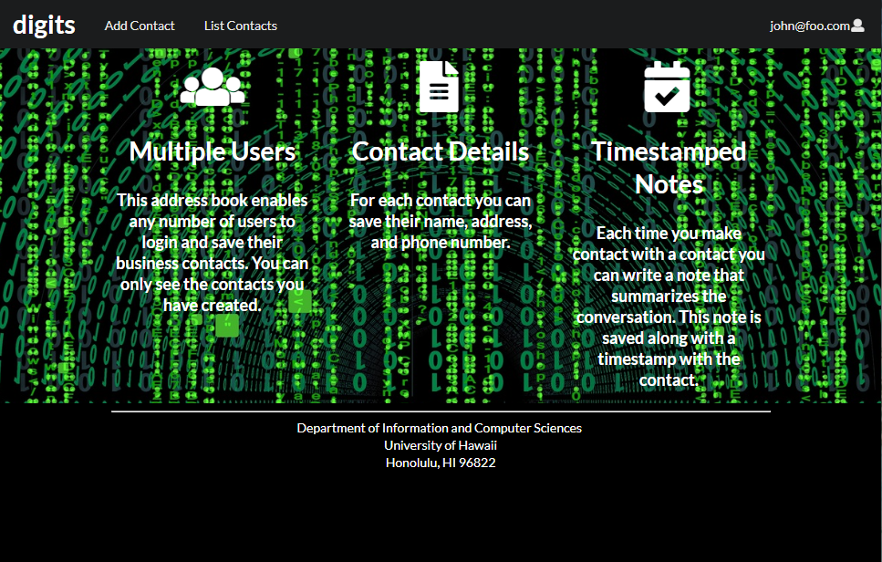

## Installation instructions: 
1. Open using github desktop application in local or download .zip file. 
2. After installation, open admin console/powershell and cd to the app directory in the digits files. 
3. Before using the 'meteor npm run start command', check if choco and meteor are installed correctly and are working. After, run the meteor command and check localhost:3000 address in your browser.

Landing page - displays default information relating to multiple users, contact details, and timestamped notes. This page is the main page connected to add contacts and list contacts pages, along with the login page.

Add contacts page - as stated in the name, is the page utilized to add new contacts using the provided text boxes

List contacts page - displays current contacts along with a textbox called 'add a timestamped note' which allows the user to add notes at specific time periods and keeps a history of it.

Login page - as stated in the name it is the page where users can log in using their regular or admin accounts. 

